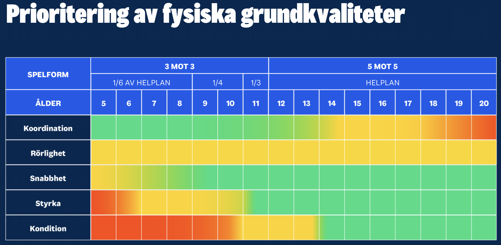

# Fysträning

## Mål med passet
Fysisk träning utanför isen som gör dig till en bättre hockeyspelare på isen.

Så här blir du bättre av att fysträna:
- Du blir snabbare och starkare i sånt du gör på isen, som skott, tacklingar och vändningar
- Du orkar göra samma sak bra flera gånger i rad, även i slutet av ett byte
- Du orkar hålla samma nivå byte efter byte, hela matchen

Spelarna ska helst inte bara HÖRA det här av tränaren - de ska komma fram till det själva. Se detektivupplägget nedan.

## Hockeydetektiverna 🕵️
Grundidén: barn ska inte undervisas, de ska upptäcka själva. Istället för att säga "balans är viktigt" ska spelarna komma fram till det på egen hand.

Under det här passet är spelarna **hockeydetektiver**. Uppdraget är att lösa ett mysterium:

> **"Hur blir man bättre på ishockey - utan skridskor?"**

De får aldrig svaret direkt av tränaren. De ska själva studera matchsituationer, prova övningar, diskutera i grupp och dra egna slutsatser - och först därefter få facit.

### Detektivmetoden - ordningen genom hela passet
1. **Titta** på en hockeybild - vad gör spelaren bra?
2. **Fundera** - vilken övning tror ni tränar upp det här?
3. **Prova** övningen på riktigt.
4. **Titta** på hockeybilden igen - ser ni något nytt nu?
5. **Diskutera** i gruppen.
6. **Motivera** - varför tror ni att övningen hjälper en hockeyspelare?
7. **Få facit** av tränaren.

## Tränarens roll: samtalsledare, inte föreläsare
Tränaren ska nästan bara ställa frågor - inte hålla en genomgång. Exempel på frågor att använda genomgående i passet:
- "Vad tror ni den här spelaren är bra på?"
- "Varför tror ni han inte ramlar?"
- "Vilken övning skulle hjälpa mest här?"
- "Varför?"

## Tränarfacit - riktiga förklaringar, inte bara ett ord
Varje övning ska ha ett facit som går djupare än "balans" eller "styrka". Facit ska koppla ihop rörelsen med exakt vad som händer i en matchsituation, så tränaren kan svara ordentligt när gruppen har motiverat sina gissningar.

**Exempel: Flygplanet / Flamingon** (stå på ett ben, luta bålen framåt med armarna ut åt sidan som vingar)

*Varför hjälper den?* När man skyddar pucken i en närkamp står nästan all vikt på en skridsko. Flygplanet tränar fotled, knä, höft och bål att jobba tillsammans, så att spelaren står kvar på skridskon trots kroppskontakt - istället för att tappa balansen och förlora pucken.

Förbered gärna en liknande, konkret förklaring för varje övning ni kör - se Hockeygym nedan för fler exempel på matchkopplingar.

## Fem saker vi tränar på
- **Snabbhet:** hinna före motståndaren till pucken
- **Rörlighet:** klara av att röra dig även när du tappat balansen i en närkamp
- **Uthållighet:** hämta andan snabbt mellan byten
- **Styrka:** snabba starter och stopp på isen
- **Koordination:** hålla balansen när du blir tacklad

Tips till tränaren: ha ett eget exempel klart för varje punkt - en matchsituation spelarna kan känna igen sig i.

## Fysisk utveckling
- Vi växer olika fort, fast vi är lika gamla

- De här spelarna kanske blir lika långa när de blir stora.
- Hur märks det just nu, på isen, att ni är olika stora och starka?

- Olika sorters träning ger olika effekt vid olika ålder.

## Hockeygym: en övning = en matchsituation 🏋️
Grundidén: varje gymövning kopplas till **EN** tydlig matchsituation - inte flera på en gång, då blir det otydligt vad man faktiskt tränar. Vi kör med hela gruppen utan gymutrustning - bara det vi faktiskt har tillgång till: mjuk matta, bänkar i omklädningsrummet, puckar och teknikkulor.

| Övning | Matchsituation |
|---|---|
| Enbens-RDL | Skydda pucken i hörnet |
| Box Jump | Första tre skären mot en lös puck |
| Jägarställning | Orka spela i låg hockeyposition |
| Rysk vridning (med puck) | Hårdare handledsskott |
| Skridskohopp | Sidledskraft och riktningsförändringar |
| Björngång | Komma upp snabbt efter ett fall |
| Bulgarian Split Squat | Kraft i ett skridskoskär |

Till varje övning vill vi bygga ett fullständigt tränarfacit (samma djup som Flygplanet-exemplet ovan): två bilder som visar tekniken, en kort teknikbeskrivning, vanliga misstag och tränartips. Se TODO.

## Matchsituationer → övningar (underlag till detektivkorten)
Den andra vägen in: börja i matchsituationen och fråga "vilken övning hjälper här?" - det är så det ska kännas för spelarna under passet. Underlag med 6 situationer, som senare kan bli riktiga situationskort med bilder (se TODO).

### 1. Skydda pucken i hörnet
- **Vad händer:** En spelare håller undan pucken i en närkamp i hörnet medan en motståndare trycker på.
- **Fråga till gruppen:** Vilket ben bär spelarens vikt? Vad tror ni krävs för att inte tappa balansen?
- **Övningar som hjälper:** Enbens-RDL, Flygplanet/Flamingon
- **Varför:** Nästan all vikt vilar på en skridsko. Båda övningarna tränar fotled, knä, höft och bål att jobba tillsammans på ett ben, så spelaren står kvar trots kroppskontakt.

### 2. Första tre skären mot en lös puck
- **Vad händer:** Två spelare startar samtidigt mot en lös puck - vem hinner först?
- **Fråga till gruppen:** Vad avgör vem som vinner de första metrarna, om båda har ungefär samma toppfart?
- **Övningar som hjälper:** Box Jump, Bulgarian Split Squat
- **Varför:** De första skären avgörs av explosiv kraft i ett ben i taget, inte uthållighet. Båda övningarna bygger just den typen av snabb, kraftfull benspänst.

### 3. Orka spela i låg hockeyposition hela bytet
- **Vad händer:** En spelare håller låg position i försvarszon, byte efter byte, utan att resa sig upp för tidigt.
- **Fråga till gruppen:** Vad händer om benen blir trötta och man reser sig upp lite för mycket mot slutet av bytet?
- **Övningar som hjälper:** Jägarställning
- **Varför:** Jägarställning bygger uthållighet i exakt den låga positionen som krävs för att hålla klubban aktiv och vara redo att flytta åt sidorna hela byten igenom.

### 4. Hårdare handledsskott
- **Vad händer:** En spelare skjuter ett handledsskott och pucken går betydligt hårdare än förra säsongen.
- **Fråga till gruppen:** Var i kroppen tror ni kraften i ett skott egentligen kommer ifrån - bara armarna, eller något mer?
- **Övningar som hjälper:** Rysk vridning (med puck)
- **Varför:** Kraften i ett skott kommer till stor del från en snabb vridning i bålen, inte bara armarna. Rysk vridning tränar precis den rotationskraften.

### 5. Komma upp snabbt efter ett fall
- **Vad händer:** En spelare ramlar efter en tackling eller ett skär och måste snabbt tillbaka i spel.
- **Fråga till gruppen:** Vad är skillnaden mellan att ligga kvar en halv sekund extra och att direkt vara redo igen?
- **Övningar som hjälper:** Björngång
- **Varför:** Björngång tränar precis övergången mellan att vara nära golvet/isen och snabbt komma upp i en stabil position - samma rörelsemönster som att resa sig efter ett fall.

### 6. Sidledsförflyttning när man dribblar
- **Vad händer:** En spelare dribblar längs kanten och byter riktning snabbt för att ta sig förbi en motståndare.
- **Fråga till gruppen:** Vad krävs för att kunna trycka ifrån hårt åt sidan utan att tappa kontrollen över pucken?
- **Övningar som hjälper:** Skridskohopp
- **Varför:** Skridskohopp tränar precis den sidledsförflyttningen och kraften i varje skär - samma rörelse som att byta riktning med pucken på klubban.

## Workshop istället för föreläsning ✏️
Barnen ska själva ge övningar roliga namn, para ihop övningar med matchsituationer, hitta på egna övningar, argumentera och rösta - inte lyssna på en lång genomgång.

1. **Hitta på (5 min):** Varje spelare skriver ner två förslag på en fysisk övning de tycker är kul - en lapp per förslag.
2. **Samla in:** Tränaren samlar in lapparna.
3. **Kör tillsammans (nästa fys-pass):** Vi provar övningarna som laget själva kommit på, enligt detektivmetoden ovan - titta på en hockeybild, gissa, prova, titta igen, diskutera, motivera och få facit.
4. **Ge den ett namn:** Laget döper övningen tillsammans, precis som i ["Syftet med övningen"](../syftet-med-övningen/index.md) - namnen blir de riktiga namnen vi använder framöver.

Ni bestämmer vilka övningar vi ska göra - då blir det roligare, och det blir ert pass!

## Idéer för framtiden
- **Upptäckarmärken:** istället för vanliga stämplar i ett träningshäfte - superkraft-symboler (t.ex. 🦅 Balansmästaren, ⚡ Raketen, 🧠 Hockeyhjärnan) som spelaren bara får när gruppen kan förklara VARFÖR övningen hjälper en hockeyspelare, inte bara för att de utfört den.
- Koppla ihop med spelförståelse-passet: samma "titta, gissa, prova, motivera, facit"-metod funkar lika bra där.

## Material
- Utgå från fys-delarna i "Barn och ungdom 1"-kursen
- Hockeybilder att studera (matchsituationer där fysik syns tydligt, t.ex. pucken skyddas i hörnet, spelare håller balansen efter tackling, första skären mot en lös puck)
- Papper och pennor till workshopen
- Utrustning vi har tillgång till för Hockeygym-övningarna: mjuk matta, bänkar i omklädningsrummet, puckar, teknikkulor

## TODO
[ ] Ha papper och pennor redo till workshopen

[ ] Förbered ett eget exempel per egenskap (snabbhet, rörlighet, uthållighet, styrka, koordination) ifall spelarna kör fast

[ ] Samla/ta bilder till de 6 matchsituationerna ovan (en bild per situation) så de kan bli riktiga situationskort

[ ] Skriv tränarfacit (teknik, vanliga misstag, tränartips) för de sju Hockeygym-övningarna, i samma stil som Flygplanet-exemplet
